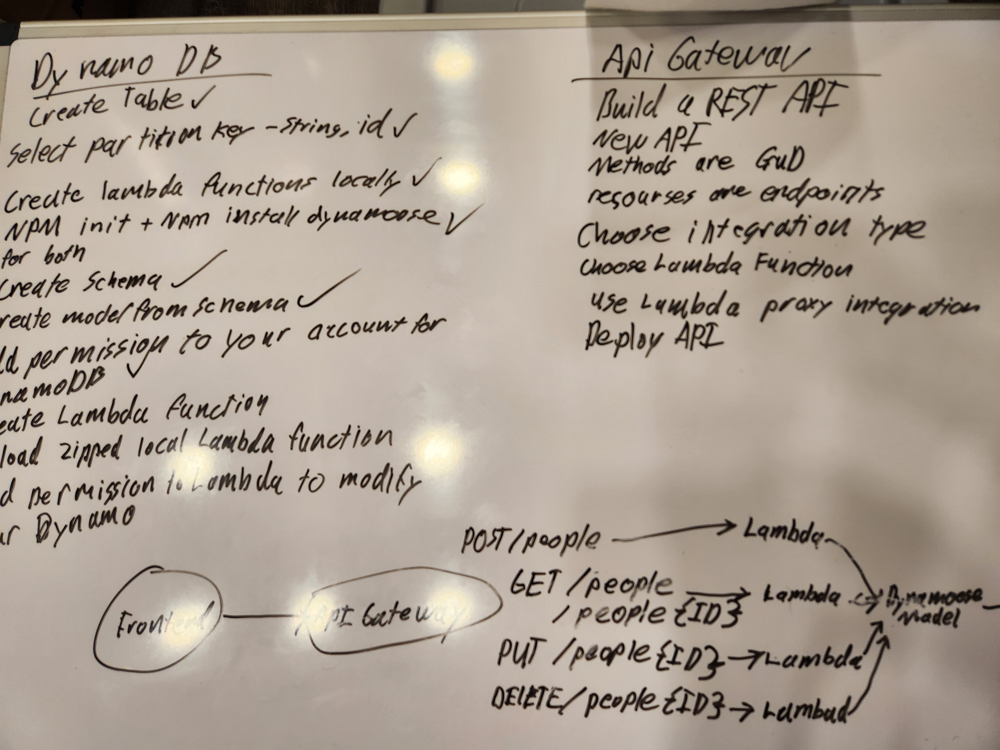

# Lab 18  

## UML  

  

## Approach  

I wrote individual functions in this folder, and then I uploaded them each to the lambda functions. I set up the API gateway to take in a get and post. Then I set up an endpoint that takes an id and gave it a get, put, and delete method. 